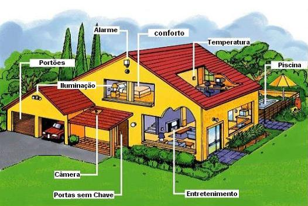

 # Projeto Integrador II
## Domótica
A domótica, também chamada de Automação Residencial, será o tema desse Projeto e pode ser definida como a integração de diversos recursos habitacionais em um sistema central capaz de automatizar e controlar ações do cotidiano. A partir desse conceito, que surgiu na década de 80, ter uma casa inteligente deixou de ser um sonho futurista e utilizando eletricidade, eletrônica e tecnologia da informação tornou-se possível otimizar as tarefas diárias das pessoas e promover uma melhora em diversos aspectos de suas vidas.
Ao longo dos anos a tecnologia vem proporcionando cada vez mais conforto e comodidade para os seres humanos e a Automação Residencial segue nesse mesmo caminho, pois é capaz de controlar iluminação, climatização, aparelhos de multimídea e muitos outros para tornar a residência mais agradável para as necessidades do morador. Certamente, os benefícios da dómotica abrangem a todos, mas ela pode ter um papel fundamental na vida de indivíduos com mobilidade reduzida possibilitando que eles realizem tarefas que antes eram difíceis com uma maior autonomia.
 A segurança é outro benefício que o uso dessa tecnologia proporciona, 

<https://www.gta.ufrj.br/grad/10_1/domotica/aplicacoes.html>
