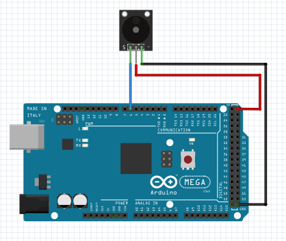

# Tenstando o Buzzer

O buzzer passivo utilizado é capaz de reproduzir sons de diferentes frequências, podendo gerar difeferentes melodias. Durante os testes foi constanto que o buzzer disponibilizado possui acionamento PNP, ou seja, para desliga-lo é necessário enviar nível lógico alto para ele. 

Para enviar a frequência sonora que será emitida pelo buzzer, utiliza-se a função tone(pino, frequência) ou tone(pino, frequência, duração) e em seguida quando for necessário desliga-lo deve-se usar as funções noTone(pino) e digitalWrite(pino, HIGH), como é possível visualizar no teste abaixo. Para reproduzir um som com frequência variando, como uma sirene, será empregada uma função seno.

### Montagem do circuito

### Código

~~~C
#define BUZZER 6  //Pino digital onde está o buzzer

float seno;
int frequencia;

void setup() {

  pinMode(BUZZER, OUTPUT); //Define o pino do buzzer como saída
  digitalWrite(BUZZER, HIGH); //Inicia com buzzer desligado
}

void loop() {

  /*Varia "x" , que será o ângulo do seno, de 0 a 180*/
  for (int x = 0; x < 180; x++)
  {
    //Converte graus para radiando e depois obtém o valor do seno
    seno = (sin(x * 3.1416 / 180));
    //Gera uma frequência a partir do valor do seno
    frequencia = 1000 + (int(seno * 1000)); //Variando de 1000 a 2000 Hz
    //Envia frequência do som para o buzzer executar
    tone(BUZZER, frequencia);
    delay(2); //Intervalo de 2ms
  }
  /*Desliga o buzzer*/
  noTone(BUZZER);
  digitalWrite(BUZZER, HIGH);
}
~~~
