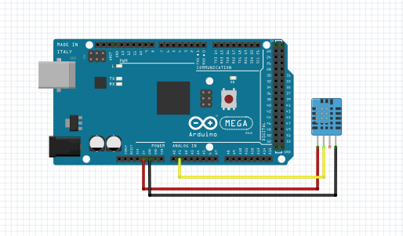

# Testando sensor de temperatura

Para utilização de sensores DHT é necessário utilizar uma biblioteca própria para ele, que possui funções para inicializa-lo, ler temperatura e ler umidade. Nesse teste os valores lidos e mensagens sobre o sensor são exibidos no monitor serial.

### Montagem do circuito

### Código

~~~C
#include "DHT.h"  //Inclui biblioteca necessária
 
#define DHTPIN A1 // Pino analógico que o sensor está conectado
#define DHTTYPE DHT11 // Modelo do DHT (DHT11)

DHT dht(DHTPIN, DHTTYPE);
 
void setup() 
{
  Serial.begin(9600);
  Serial.println("DHTxx test!");
  dht.begin();
}
 
void loop() 
{
  float h = dht.readHumidity(); //armazena a leitura da umidade em "h"
  float t = dht.readTemperature(); //armazena a leitura da temperatura em "t"
  if (isnan(t) || isnan(h)) // testa se retorno é valido, caso contrário algo está errado
  {
    Serial.println("Falha na leitura do DHT"); //Exibe mensagem no montitor serial
  } 
  else
  {
    //Exibe a umidade e temperatura lidas no monitor serial
    Serial.print("Umidade: ");
    Serial.print(h);  
    Serial.print(" %t");
    Serial.print("Temperatura: ");
    Serial.print(t);
    Serial.println(" *C");
  }
  delay(3000);  //Intervalo de 3s
}
~~~
