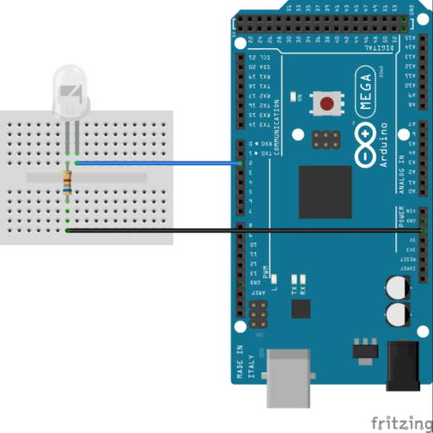

## Testando LEDs

Acender LEDs é o primeiro passo para entender o funcionamento do arduíno e funções básicas como pinMode e digitalWrite. Inicialmente, será exibido a montagem do circuito e o código para uma aplicação simples de pisca LED.

~~~C
#define LED 2  //define o pino digital em que o LED está conectado

/*A função setup é utilizada para inicializaçãoe é executada apenas uma vez*/ 
void setup() 
{
  pinMode(LED, OUTPUT); //inicializa o pino em que o LED está como saída 

}

/*A função loop é executada repetidamente*/ 
void loop() 
{
  // Acende o LED
  digitalWrite(LED, HIGH);   
  //Aguarda intervalo de tempo em milissegundos
  delay(1000);  
  // Apaga o LED
  digitalWrite(LED, LOW);    
  //Aguarda intervalo de tempo em milissegundos
  delay(1000);              
}
~~~

