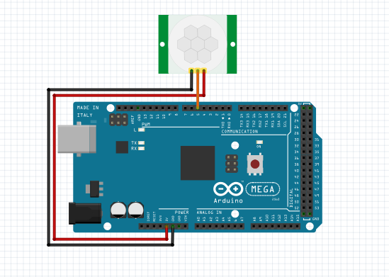

# Testando sensor de presença

O sensor de presença PIR é conectado a um pino digital de entrada, quando é detectada presença o sensor envia para o Arduino nível lógico alto. Portanto, utilizando a função digitalRead()
é possível identificar quando há presença e realizar a ação que desejar em seguida, nesse caso a mensagem "Presença destectada" é exibida no monitor serial.

### Montagem do circuito

### Código

~~~C
#define PIR    5   //Pino digital onde está o sensor de presença

void setup() {

  pinMode(PIR, INPUT); //Configura o pino do PIR como pino de entrada

  Serial.begin(9600); //Inicializa o monitor serial
}

void loop() {
  if ((digitalRead (PIR)) == HIGH) //Se houver movimento faz:
    Serial.println("Presença detectada"); //Exibe no monitor serial

}
~~~
