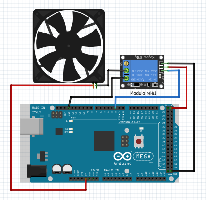

# Testando o Cooler acionado pelo módulo relé
O relé nada mais é que uma chave que é controlado por corrente elétrica, o módulo relé utilizado deve ser alimentado com 5V e será controlado por um pino digital do arduíno. Ele pode ser ativado com nível lógico alto ou baixo, dependendo da forma como ele se conecta ao circuito.
Nesse caso ele será ativado em nível lógico alto, portanto deve-se utilizar o seu contato chamado NA(normalmente aberto) e o contato chamado comum para conectar o cooler à sua alimentação que também é de 5V.

### Montagem do circuito

### Código

~~~C
#define RELE 2   //Pino digital onde o relé está
  
void setup()
{
  /*Define pino do rele como saída*/
  pinMode(RELE, OUTPUT);   
}
   
void loop()
{
  digitalWrite(RELE, HIGH);  //Liga relé 
  delay(2000); //Espera 2 segundos
  digitalWrite(RELE, HIGH); //Desliga o relé
  delay(2000); //Espera 2 segundos
}
~~~

