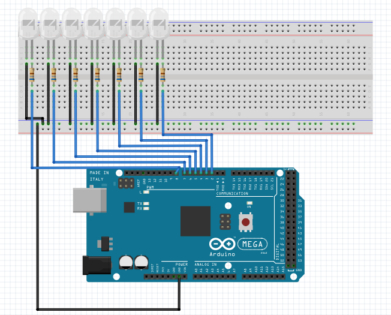

# Usando o Monitor Serial
O Monitor Serial é uma ferramenta importante da plataforma Arduino que torna possível transmitir ou ler informações na forma de texto. Ele será fundamental para a construção do projeto, pois por meio dele será feita a comunicação com o usuário, exibindo dados e mensagem sobre o sistema na tela do computador e recebendo via teclado todos os comandos para executar tarefas. 

Para demonstrar o seu funcionamento foi criada uma aplicação para acender e apagar 7 LEDs utilizando os números de 1 a 7 do teclado. Cada LED muda seu estado atual quando for enviado o número correspondente a ele para o Monitor Serial. 

### Montagem do Circuito

### Código

~~~C
/*Declaração da conexão dos componentes nos pinos*/
#define LED1 2
#define LED2 3
#define LED3 4
#define LED4 5
#define LED5 6
#define LED6 7
#define LED7 8

/*Declaração da função*/
void ler_teclado();

void setup()   {

  // inicializamos a porta serial onde vamos escrever
  //os dados que serao lidos pela função Serial.read()
  Serial.begin(9600);
  
  /*Inicializa pinos dos LEDs como saída*/
  pinMode(LED1, OUTPUT);
  pinMode(LED2, OUTPUT);
  pinMode(LED3, OUTPUT);
  pinMode(LED4, OUTPUT);
  pinMode(LED5, OUTPUT);
  pinMode(LED6, OUTPUT);
  pinMode(LED7, OUTPUT);
  
  }
  
  void loop()
{
  ler_teclado();
}

void ler_teclado() {
  /*A função Serial.available() retorna um valor diferente de 0 se tiver algo para ler no monitor*/
  if (Serial.available() != 0)
  {
    char tecla;             //inicializa uma variavel do tipo char chamada tecla 
    /*A função Serial.read() lê o que foi escrito no monitor e o valor será armazenado em "tecla"  */
    tecla = Serial.read();  
    
    //Cada tecla controla um LED
    switch (tecla)
    {
      case '1':
        digitalWrite(LED1, !digitalRead(LED1));
        break;
      case '2':
        digitalWrite(LED2, !digitalRead(LED2));
        break;
      case '3':
        digitalWrite(LED3, !digitalRead(LED3));
        break;
      case '4':
        digitalWrite(LED4, !digitalRead(LED4));
        break;
      case '5':
        digitalWrite(LED5, !digitalRead(LED5));
        break;
      case '6':
        digitalWrite(LED6, !digitalRead(LED6));
        break;
      case '7':
        digitalWrite(LED7, !digitalRead(LED7));
        break;                        
                            

~~~
