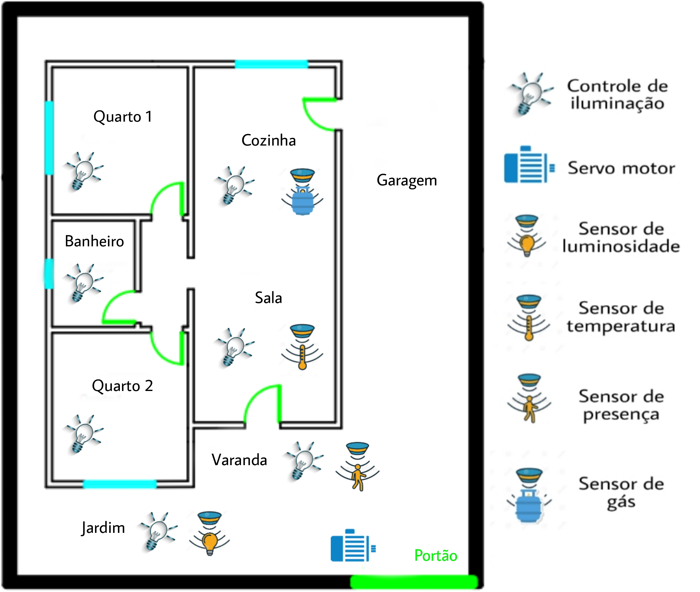

# Concepção
O objetivo do projeto é criar um sistema de automação residêncial que proporcione mais conforto, comodidade, segurança e economia para o morador e atenda aos requisitos estabelecidos. Devido ao intuito didático do projeto, esse sistema será implementado em uma maquete que será projetada por cada aluno, utilizando componentes eletrônicos para simular o funcionamento dos equipamentos que seriam controlados na residência.

Visando satisfazer o objetivo do projeto da melhor forma possível os recursos utilizados na automatização da casa serão:

* Controle remoto de toda a iluminação da casa.
* Controle da iluminação no jardim utilizando um sensor de luminosidade.
* Controle da temperatura, utilizando um sensor para ligar um ventilador localizado na sala.
* Sensor de presença para acender a luz e acionar um alarme localizado na varanda.
* Sensor de gás para detectar vazamentos localizado na cozinha, avisando o morador por meio do alarme e mensagem com instruções.
* Servomotor para controlar o portão.
* Display LCD mostrando informações relevantes sobre o sistema.
* Controle de todo o sistema, ligar e desligar recursos, remotamente.

Utilizando o software AutoCAD Web foi criada a planta baixa da casa que será automatizada, com o intuito de facilitar a visualização do projeto. A imagem a seguir mostra a planta baixa e as tecnologias que serão implementadas em cada ambiente:

# Referências
 
 * [AutoCAD Web](https://web.autocad.com/login.)
