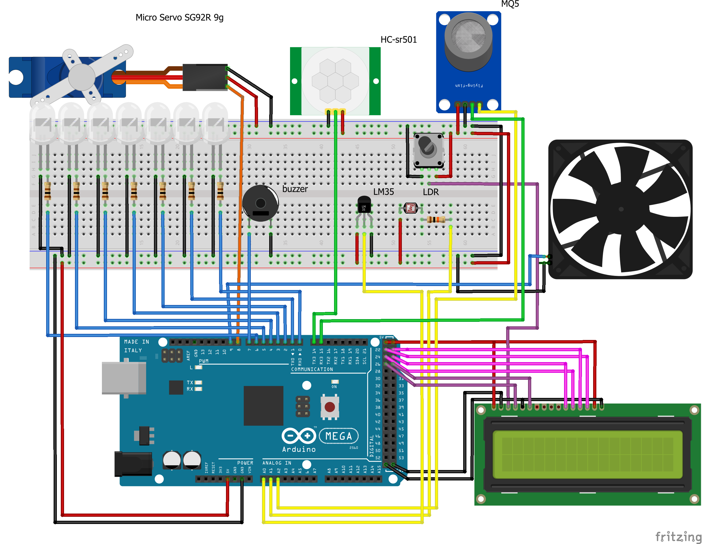

# Design

No presente momento do projeto, faz-se necessário definir os componentes e materiais que serão utilizados para sua implementação, bem como a disposição das ligações entre eles. Para tal, foi criada uma tabela com os componentes e uma maquete elêtrônica que serão exibidos a seguir:
 
 ## Tabela de componentes
 
Componente | Quantidade 
:-----------:|:-------------:
Arduino Mega 2560 |   1
Micro Servo SG92R 9g |   1
HC-sr501 |   1
MQ2 |   1
DHT11 |   1
LDR |   1
Módulo Buzzer Passivo 5V |   1
Módulo relé 5V |   1
Cooler 5V  |   1
Potenciômetro B10k |   1
Display LCD 16x2 |   1
LED Branco |   7
Resistor 330 ohm |   7
Resistor de 10k ohm |   1

## Maquete Eletrônica

A maquete eletrônica foi construída utilizando o software Fritzing, com ela é possível planejar como serão feitas as conexões entre os materiais na etapa da implementação. A seguir, será apresentada uma breve explicação de cada componente que compõe o projeto e o motivo pelo qual eles foram selecionados:

* Arduino Mega 2560: É o responsável por controlar todo o sistema e por essa razão todos os demais componentes são conectados aos seus pinos de entrada e saída. O Arduino Mega 2560 foi selecionado por possuir um maior número de portas e mais memória, se comparado ao Arduino Uno.

* Micro Servo SG92R 9g: É controlado por meio de um pino de saída PWM e será responsável por controlar o portão da casa. Esse modelo é ideal para utilização com arduino, pois é alimentado com 5V, que é a mesma tensão que o arduino fornece, além de seu tamanho reduzido que é uma vantagem para essa aplicação.

* HC-sr501: Esse é o modelo do sensor de presença que será utilizado, ele é alimentado com 5V e é conectado a um pino de entrada digital. Quando detectado algum movimento ele enviará nível lógico alto para o arduíno.

* MQ2: Sensor de gás selecionado pois ele detecta GLP(gás de cozinha) e fumaça. Ele é conectado a um pino de entrada digital que receberá nível lógico alto quando for detectado gás e um pino de entrada analógica que receberá a concentração de gás verificada pelo sensor.

* DHT11: Sensor de temperatura e umidade alimentado com 5V, ele envia os dados registrados por um pino de entrada analógica

* LDR: É um sensor de luminosidade e sua resistência varia de acordo com a intensidade de luz, desse modo é necessário um resistor para que o pino de entrada analógica do arduino possa identificar a variação de resistência no LDR por meio da tensão sobre ele. 

* Buzzer Passivo 5V : Controlado por um pino de saída digital emitirá diferentes sons para alertar o usuário do sistema.

* Módulo relé 5V: O relé será acionado por meio de um pino de saída digital e será utilizado para controlar o cooler. O uso dele faz-se necessário, pois a corrente dos pinos de saída não seriam suficientes para liga-lo e além é mais seguro devido ao relé isolar o cooler do microcontrolador.

* Cooler 5V: Liga e desliga por meio de um pino de saída digital.

* Display LCD 16x2: O display possui 16 pinos, sendo os pinos 1 e 2 alimentação, pino 3 é conectado a um potenciômetro para controle do contraste do LCD, pinos 4 e 6 são conectados em pinos de saída digital e são para controle, pino 5 seleciona o modo escrita ao ser conectado ao GND. Já os pinos de 11 a 14 são os responáveis pelo envio de dados para o LCD e os pinos 15 e 16 são conectados à alimentação para acender a tela de fundo. Ele será resposável por exibir mensagens sobre o funcionamento do sistema.  

* LED Branco: Os LEDs serão controlados por pinos de saídas digitais e necessitam de resistores para que tenham tensão de 3V e corrente de 20mA.

