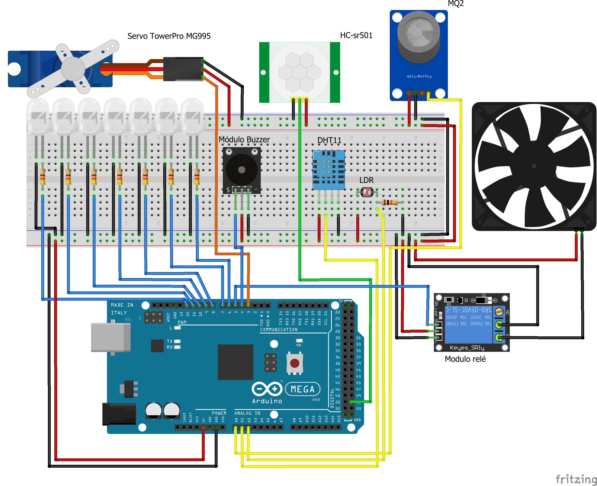

# Design

Tendo em vista as ideias descritas anteriormente na concepção, inicia-se o projeto do sistema a fim de viabilizar o que foi planejado. No presente momento, faz-se necessário definir os componentes e materiais que serão utilizados para sua implementação, bem como a disposição das ligações entre eles. Álem disso, nessa etapa é essencial realizar o teste dos componentes e definir os algoritmos que serão utilizados. Para tal, foi criada uma tabela com os componentes, uma maquete elêtrônica e códigos para teste que serão exibidos a seguir:
 
 ## Tabela de componentes
 
Componente | Quantidade 
:-----------:|:-------------:
Arduino Mega 2560 |   1
Servo TowerPro MG995 |   1
HC-sr501 |   1
MQ2 |   1
DHT11 |   1
LDR |   1
Módulo Buzzer Passivo 5V |   1
Módulo relé 5V |   1
Cooler 5V  |   1
Display LCD I2C 16x2 |   1
LED Branco |   6
LED Verde |   1
Resistor 680 ohm |   7
Resistor de 10k ohm |   1

## Maquete Eletrônica

Por meio da confecção de uma maquete eletrônica é possível planejar como serão feitas as conexões entre os materiais na etapa da implementação. A seguir, será apresentada uma breve explicação de cada componente que compõe o projeto e o motivo pelo qual eles foram selecionados:

* Arduino Mega 2560: É o responsável por controlar todo o sistema e por essa razão todos os demais componentes são conectados aos seus pinos de entrada e saída. O Arduino Mega 2560 foi selecionado por possuir um maior número de portas e mais memória, se comparado ao Arduino Uno.

* Servo TowerPro MG995: É controlado por meio de um pino de saída digital PWM e será responsável por controlar o portão da casa. Esse modelo é ideal para utilização com arduino, pois é alimentado com 5V, que é a mesma tensão que o arduino fornece, além de seu tamanho reduzido que é uma vantagem para essa aplicação.

* HC-sr501: Esse é o modelo do sensor de presença que será utilizado, ele é alimentado com 5V e é conectado a um pino de entrada digital. Quando detectado algum movimento ele enviará nível lógico alto para o arduíno.

* MQ2: Sensor de gás selecionado pois ele detecta GLP(gás de cozinha) e fumaça. Ele pode ser conectado a um pino de entrada digital que receberá nível lógico alto quando for detectado gás e um pino de entrada analógica que receberá a concentração de gás verificada pelo sensor.

* DHT11: Sensor de temperatura e umidade alimentado com 5V, ele envia os dados registrados por um pino de entrada analógica.

* LDR: É um sensor de luminosidade e sua resistência varia de acordo com a intensidade de luz, desse modo é necessário um resistor para que o pino de entrada analógica do arduino possa identificar a variação de resistência no LDR por meio da tensão sobre ele. 

* Módulo Buzzer Passivo 5V : Controlado por um pino de saída digital PWM, emitirá diferentes sons para alertar o usuário do sistema.

* Módulo relé 5V: O relé será acionado por meio de um pino de saída digital e será utilizado para controlar o cooler. O uso dele faz-se necessário, pois a corrente dos pinos de saída não seriam suficientes para liga-lo, além de ser mais seguro devido ao relé isolar o cooler do microcontrolador.

* Cooler 5V: Liga e desliga por meio do relé, alimentado com 5V.

 * Display LCD 16x2 I2C: O display LCD necsessita de diversos pinos para se conectar ao Arduino, porém com módulo I2C integrado essa conexão é feita utilizando apenas quatro pinos. Dois pinos são utilizados para alimentação e os outros dois para comunicação, no caso do Arduino Mega os pinos I2C a serem utilizados são o 20 (SDA) e 21 (SCL). O display LCD será resposável por exibir mensagens sobre o funcionamento do sistema.  

* LEDs: Os LEDs serão controlados por pinos de saídas digitais e necessitam de resistores para que tenham tensão de 3V e corrente menor que 5mA.

## Testes dos componentes e algoritmos

Após a obtenção dos componentes definidos, é necessário entender o funcionamento e realizar os testes de cada item separadamente. Desta forma, é possível identificar possíveis problemas a serem solucionados e dúvidas a serem sanadas.

A programação é realizada por meio da [IDE Arduino](https://www.arduino.cc/en/software) e antes de executar os códigos é preciso selecionar o modelo da placa que será utilizado, nesse caso Arduino Mega 2560. Nos links abaixo serão descritos como foram realizados os testes de cada parte do projeto:

* [LEDs](./Testes/LEDs.md)
* [Cooler e Relé](./Testes/Rele_Cooler.md)
* [Servo](./Testes/Servo.md)
* [Buzzer](./Testes/Buzzer.md)
* [Sensor de temperatura e umidade](./Testes/DHT.md)
* [Sensor de luminosidade](./Testes/LDR.md)
* [Sensor de presença](./Testes/PIR.md)
* [Sensor de gás](./Testes/MQ2.md)
* LCD: O LCD disponibilizado não estava funcionando, portanto não será utilizado nas etapas seguintes.

Há alguns cuidados a serem tomados para um funcionamento adequado de um sistema com diversas tarefas senso executadas repetidamente, como por exemplo não utilizar funções que bloqueiem completamente o sistema que é o caso da função delay().  Além disso, certas tarefas não precisam ou não podem ser executadas a todo momento, sem um tempo de espera, por esses motivos algumas delas serão temporizadas.

Para exemplificar, a técnica de multitarefas que será utilizada, o código abaixo demostra como temporizar duas tarefas simples de piscar LED:

* [Exemplo tarefas](./Codigos/ex_tarefas.ino)

Uma ferramente que será muito importante para o sistema é o monitor serial, pois ele torna possível transmitir ou ler informações na forma de texto. Ele será fundamental para a construção do projeto, pois por meio dele será feita a comunicação com o usuário, exibindo dados e mensagem sobre o sistema na tela do computador e recebendo via teclado todos os comandos para executar tarefas. Para exemplificar o seu funcionamento foi criada uma aplicação para acender e apagar 3 LEDs utilizando os números de 1 a 3 do teclado. Cada LED muda seu estado atual quando for enviado o número correspondente a ele para o Monitor Serial:

* [Exemplo Monitor Serial](./Codigos/ex_serial.ino)

# Referências

* [Fritzing](https://fritzing.org/)
* [Tutorial Arduino LPAE](https://github.com/LPAE/arduino_tutorial)
* [Utilizando sensor de presença](https://www.filipeflop.com/blog/acendendo-uma-lampada-com-sensor-de-presenca/)
* [Utilizando sensor de gás](https://blogmasterwalkershop.com.br/arduino/como-usar-com-arduino-sensor-detector-de-gas-inflamavel-fumaca-mq-2)
* [Utilizando LDR](https://www.filipeflop.com/universidade/kit-maker-arduino/projeto-10-sensor-de-luz-ambiente/)
* [Utilizando DHT11](https://www.filipeflop.com/produto/sensor-de-umidade-e-temperatura-dht11/) 
* [Utilizando servo mototr](https://blogmasterwalkershop.com.br/arduino/como-usar-com-arduino-servo-motor-mg995
) 
