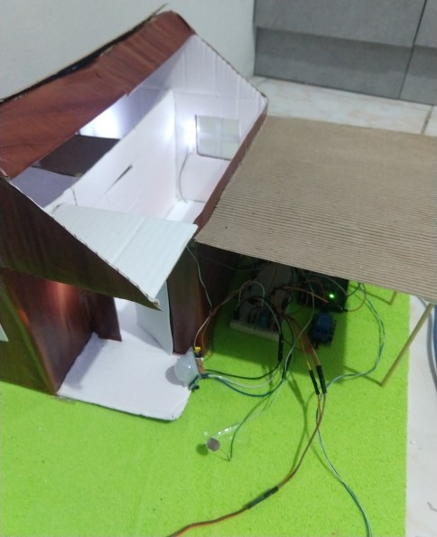

# Implementação

Nas etapas anterioires, concepção e design, foram idealizadas e em seguida planejadas todas as funcionabilidades para aplicar o conceito da domótica em uma maquete e nessa etapa da implementação é o momento de materializar o projeto. A seguir, serão descritos os processos de fabricação da maquete, codificação, teste e validação de cada tarefa do sistema e integração do todo para obtenção dos resultados desejados. 

## Fabricação da maquete

Na etapa da concepção foi apresentada a planta baixa da casa em questão, baseando-se nela a maquete foi confeccionada. Para a construção da estrutura da casa foram utilizadas caixas de papelão e como base para a maquete uma placa de isopor. Além disso foram empregues outros materiais a fim de aprimorar a estética da casa, como EVAs e papel adesivo.

Alguns componentes estarão localizados nos cômodos da sala e cozinha, como o cooler e o sensor de gás, portanto para ser possível a visualização destes a casa possui um telhado removível. O arduino e matriz de contatos serão localizados na região da garagem e os fios de conexão levarão os componentes aos seus locais definidos.

## Tarefas realizadas pelo sistema

Na etapa anterior, foram realizados os testes individuais de cada componente, portanto para a criação das tarefas é necessário apenas integra-los da forma correta. Vale lembrar que as tarefas serão escalonadas na função loop, utilizando o métopo de multitarefas exemplicado no design. A baixo serão detalhadas cada tarefa, e seu respectivo funcionamento:

### Leitura do sensor de presença

Essa tarefa faz a leitura do sensor PIR e caso seja detectada presença ela é responsável por acender um LED, ligar o alarme e enviar uma mensagem para o monitor serial. O alarme pode ser desligado e ligado via teclado, assim como toda a tarefa. Essa tarefa é temporizada e é declarada da seguinte forma:

~~~ C
void ler_PIR (unsigned long tempo_atual)
~~~

### Leitura do sensor de gás

Faz a leitura do sensor de gás e exibe o valor lido no monitor serial, quando esse valor atingir o limite máximo estipulado o alarme é ligado e uma mensagem é exibida no monitor serial. Essa função também é temporizada e é declarada como:

~~~ C
void ler_MQ2(unsigned long tempo_atual) 
~~~

### Leitura do sensor de temperatura e umidade

Função temporizada responsável por ler os valores de temperatura e umidade e exibi-los no monitor serial, além disso quando a temperatura atinge um limite definido o cooler é acionado. O sistema de refrigeração com cooler pode ser ligado e desligado via teclado. A declaração desse tarefa é:

~~~ C
void ler_DHT(unsigned long tempo_atual)
~~~

### Leitura do sensor de luminosidade 

A leitura temporizada do LDR é feita por essa tarefa, o valor lido pela por porta analógica é exibido no monitor serial e controla a iluminação do jardim. Quando a luminosidade for baixa, de acordo com um valor limite estipulado, um LED verde será aceso e quando a luminosidade for alta o LED apagará. Esse sistema de iluminação pode ser desligado e ligado por meio do teclado e a função para ela é:

~~~ C
void ler_LDR(unsigned long tempo_atual)
~~~ 

### Controle do portão

Essa é uma função não temporizada e ela é executada somente quando o usuário envia um comando pelo teclado. Ela é responsável por girar o motor de 10° a 90° e em seguida quando o usuário apertar novamente a tecla destinada ao portão o motor irá retornar para a posição 0°. A funçao é declarada da forma exibida a seguir e a variável booleana que ela recebe indica qual movimento o motor deve fazer, icrementar ou decrementar o ângulo.

~~~ C
void controle_portao (bool portao)
~~~

### Exibir status do sistema

Essa função é responsável por exibir no monitor serial se os sistemas dos sensores estão ligados ou desligados, ela só é executada quando o usuário envia um comando via teclado. A sua declaração é:

~~~ C
void status_sistema ()
~~~

### Exibir menu de comandos

Responsável por mostrar ao usuário, por meio do monitor serial, quais os comandos que ele deve enviar via teclado para controlar cada parte do sistema. O menu é exibido assim que o sistema é inicializado, na função setup(), e em seguida pode ser requisitado novamente utilizando a tecla 'i'. Como a função não recebe nenhum argumento e não gera nenhum retorno sua declaração é:

~~~ C
void menu ()
~~~

### Ler comandos do teclado 

E por fim essa tarefa que é muito importante para o sistema, ela é encarregada de ler as teclas enviadas pelo teclado e realizar a sua respectiva ação. A função não é temporizada e ela só será inteiramente executada quando algo for enviado pelo monitor serial. As teclas são usadas para controlar os LEDs, o portão e o cooler, além disso há teclas para ligar e desligar partes do sistema e uma tecla para exibir o status do sistema. A declaração da função é:

~~~ C
void ler_comandos()
~~~

# Integração e validação do projeto

Integrar as tarefas e funções do código é feito de forma muito simples, primeiramente são declarados todos os pinos onde estão conectados os componentes, variáveis globais e funções e em seguida na função setup() é realizada a inicialização de todo o sistema. Na função loop() são chamadas todas as tarefas temporizadas e a função ler_comandos() de acordo com o exemplo de multitarefas mostrado anteriormente. O resultado final do código do sistema pode ser visualizado no link abaixo:

* [Código completo casa automatizada](./Codigos/casa_automatizada.ino)

Por fim, os componentes foram dispostos nos seus devidos lugares na maquete e foram realizados diversos testes para validação do projeto. A seguir, estão listados alguns dos testes aplicados:

* Ativar os sistemas de cada sensor, individualmente e em conjunto.
* Liberar gás com um isqueiro para acionar o sensor de gás.
* Modificar a temperatura de acionamento do cooler para a temperatura do ambiente.
* Modificar a luminosidade limite do LDR para a luz do ambiente.
* Ligar e desligar LEDs e cooler.
* Abrir e fechar o portão. 

Por meio destas ações foi possível concluir que todo o sistema funciona corretamente, cumprindo com o que foi planejado nas etapas anteriores de concepção e design.

