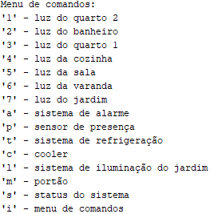

# Operação

Durante as etapas anteriores foi descrito todo o processo de construção do projeto, para que fosse possível chegar a essa última etapa da abordagem CDIO, na qual o sistema implementado é utilizado para seus devidos propósitos. As intruções e modo de operação do sistema serão descritas e demonstradas nessa etapa.

## Instruções de uso

Para inicialização do sistema, conecta-se o Arduino ao computador via USB e por meio da IDE do Arduino faz-se a compilação do código fonte do sistema. A comunicação com o usuário é realizada pelo monito serial do Arduino, no qual serão exibidas as mensagens e medições realizadas e receberá os comandos enviados pelo teclado. As teclas de controle e suas respectivas ações são exibidas a seguir:

Cada tecla é responsável por ligar/desligar alguma parte do sistema, exceto 'm' que controla o portão, 's' que exibe no monitor quais os sensores ativos e 'i' que exibe o menu de comandos visto acima.

Todos os LEDs e o cooler possuem uma tecla para sua ativação e desativação, porém ao ligar um sistema para controlá-los automaticamente suas respectivas teclas perdem a utilidade.
Como é o caso da ativação do cooler por sensor de temperatura, caso o sistema de refrigeração seja ativado a tecla 'c' não o comandará mais. Isso também ocorre com o LED da varanda e com o LED do jardim.

Abaixo, segue o link para um vídeo demonstrando a operação do sistema :

<https://www.youtube.com/watch?v=8g38VPzZA6s>

## Possíveis evoluções 

O protótipo desenvolvido automatiza uma maquete de forma simples, utilizando a comunicação via USB do Arduino, possíveis melhorias para o sistema são a inclusão de ethernet shield ou módulo wi-fi e desenvolvimento de um aplicativo para uma comunicação mais eficiente com o usuário. Além disso, pode-se expandir esse projeto para controlar itens de uma residência, como por exemplo acionar equipamentos do cotidiano utilizando módulos relé. 

